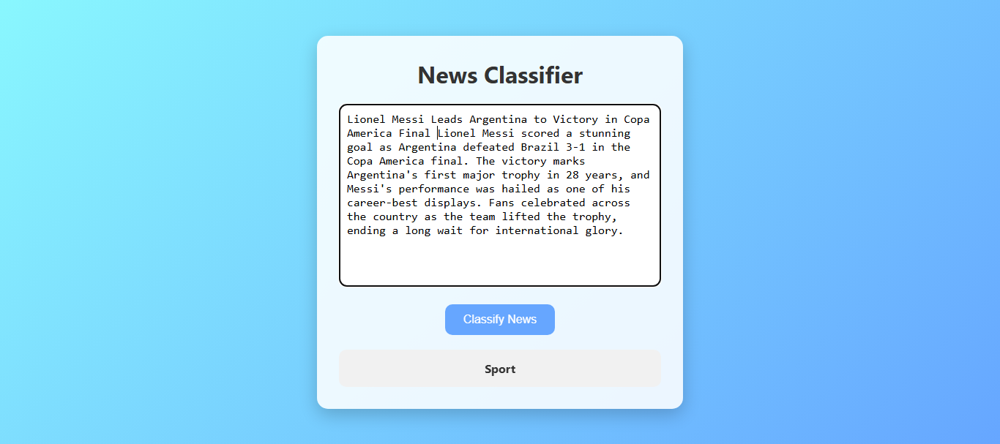

<p align="center">
  
</p>

## 📰 News Classifier

Flask-based **News Classifier** that categorizes news articles into **Sports**, **World**, **Politics**, and **Tech/Science** using a **machine learning model**.

---


---

### 📑 Table of Contents
- [About](#-about)
- [Tech Stack](#-tech-stack)
- [Features](#-features)
- [Dataset](#-dataset)
- [Screenshot](#-screenshot)
- [Roadmap](#-roadmap)
- [Contributing](#-contributing)
- [How to Use](#-how-to-use)
- [License](#-license)
- [Contact](#-contact)

---

### 🔍 About

This project is a Flask-based web application 🌐 that classifies news articles into four categories:
🏅 Sports
🌍 World
🏛️ Politics
🔬 Tech/Science
It uses a trained machine learning model 🤖 to analyze the input text and predict the most relevant.

---

  ### 🚀 Tech Stack


---

### ✨ Features

- 🧠 Uses NLP techniques (tokenization, TF-IDF) for text preprocessing.
- 🤖 Machine Learning model trained on news dataset.
- 🔎 Classifies news into Sports, World, Politics, Tech/Science.
- 📊 Shows real-time prediction through Flask interface.
- 🌐 Simple web interface built with HTML + CSS + Flask.

  <details>
  <summary>📌 Why use this project?</summary> This project is helpful for **students and beginners** who want to learn how to integrate **Flask + Machine Learning + NLP** for real-world applications. 
</details>

---

## 💾 Dataset

https://www.kaggle.com/datasets/amananandrai/ag-news-classification-dataset

---

### 📸 Screenshot
| Page |
|-----------|
| 

---

### 📂 How to Use
1. Clone the repo
   ```bash
   git clone https://github.com/your-username/all-in-one-calculator.git
   ```
2. Navigate to the project folder
   ```bash
   cd all-in-one-calculator
   ```
3. Open `index.html` in your browser.

---

### 📍 Roadmap

- 🎨 Improve UI with a modern and responsive design.
- 🗂️ Add database support to store classified news articles.
- ☁️ Deploy on cloud platforms (Heroku / Render / AWS).
- 📈 Add confidence score visualization for predictions.
- 🌐 Extend to more categories (e.g., Business, Health, Entertainment).

---

### 🤝 Contributing

Contributions, issues, and feature requests are welcome!
Feel free to fork this repository and submit pull requests.

---

### 📄 License

This project is licensed under the MIT License – see the [LICENSE](LICENSE) file for details.

---

### 📬 Contact

 [](mailto:cornerofcodes00@gmail.com)
[](https://www.linkedin.com/in/muhammad-muzammil-irshad-05b863333)
[](https://www.tiktok.com/@cornerofcodes)

---

<p align="center"><b>Made with ❤️ by M Muzammil Irshad</b></p>

---
